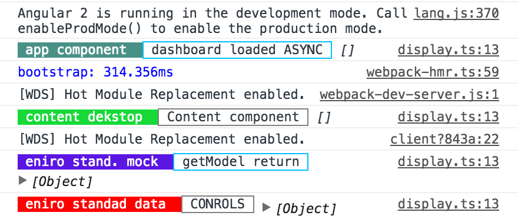
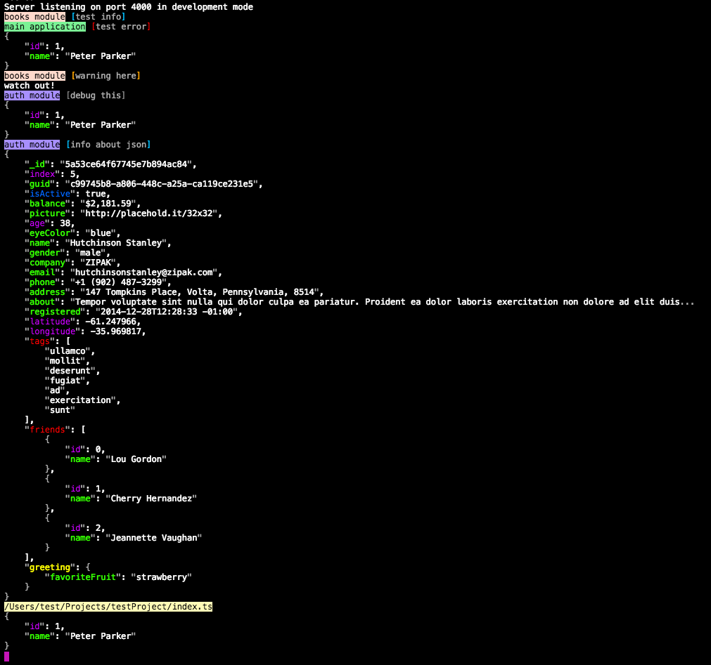

## ng2-logger ##


**IMPORTANT** 

- from version 3.x I am using new javascript ***"esnext" + "es2015"*** instead of *"commonjs + es5"*
- from version 8.x I am using angular compiler (ngcc)

for browser version.

  

## Description ##

  

Isomorphic Logger for TypeScript and JavaScript apps.

  

You can use this logger in your apps with **any**

TS/JS framework.
 

See what is going on in your app!

Now chrome console logs are full of colors!

  



  

See nice server logs:

  



  
  

To install package run:

  

npm install ng2-logger --save

  

First import proper version for your environment:

  

Nodejs server:

  

```ts

import { Log, Level } from  'ng2-logger'

```

or Browser:

  

```ts

import { Log, Level } from  'ng2-logger/browser'  // new javascript module: es2015 + esnext + angular ivy support

```

  

Simple use:

  

In your file with log:

```ts

const  log  =  Log.create('books');

```

or if you wanna just log errors and warnings :

```ts

const  log  =  Log.create('books', Level.ERROR, Level.WARN);

```

'books' is current class or anything inside *.ts/*.js file.

  

You can also assign static color to specific module in application (browser for now only):

```ts

log.color  =  'red';

```

After inited **log** you are able to start debugging:

```ts

log.d('object',obj) // console.log

log.er('object',obj) // console.error

log.i('object',obj) // console.info

log.w('object',obj) // console.warn

```

or

```ts

log.debug('object',obj) // console.log

log.error('object',obj) // console.error

log.info('object',obj) // console.info

log.warn('object',obj) // console.warn

```

  
  

**Production mode**

-------------------

  

You will not see anyting in prduction mode:

  

// enable production mode in your app

...

Log.setProductionMode();

...

// your app code with console and ng2-logger logs

  
  

It is important to set production mode before any log messages are executed.

This will ensure that log messages that should not be seen are leaked out.

  
  

**Selective debug - global settings**

-------------------

  

Optional specify what you wanna see in yours debug console.

This settings will override settings from files.

  

```ts

Log.setProductionMode();

Log.onlyModules('src:books', 'src:records', 'src:page:login');

Log.onlyLevel(Level.ERROR,Level.INFO);

```

  

**Specifying `onlyModules` as regular expression(s)**

-------------------

  

In the above example you'll notice `module:books` and `module:records` were specified.

you might be using such syntax for namespace hierarchy etc. You may also pass in one or more regular

expression string(s) to the `onlyModule` function to specify a selection of modules you wish

to show, for instances those whose name begins with `src`:

  

```ts

  

Log.onlyModules( new  RegEx('^.src') );

```
