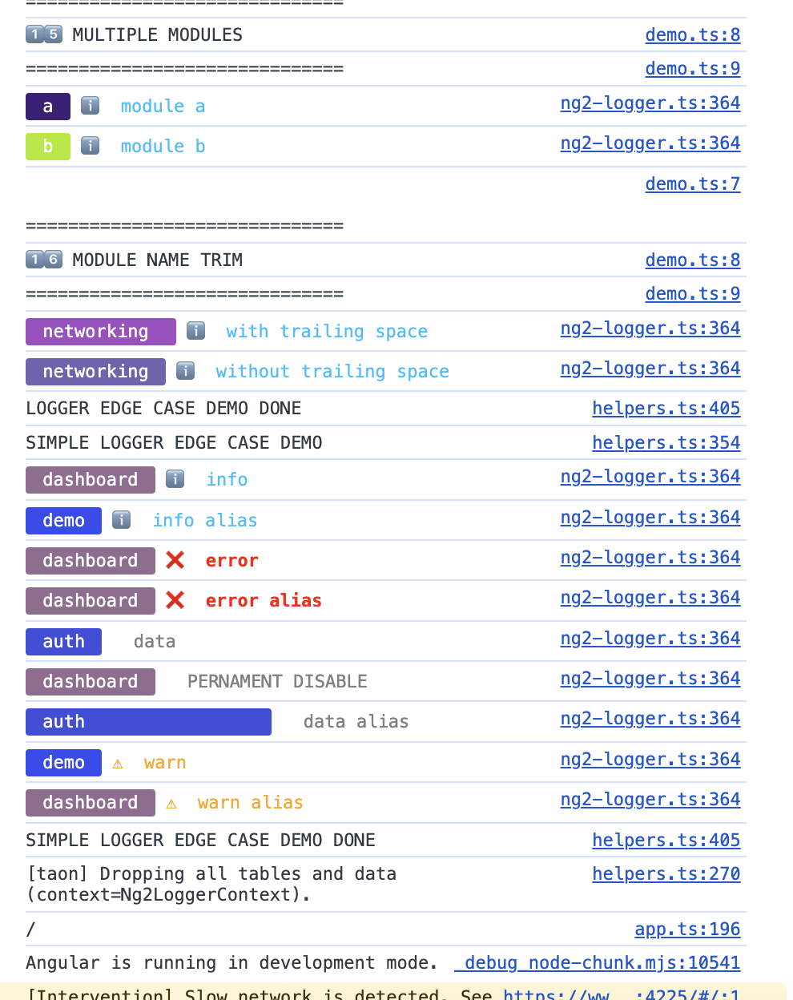
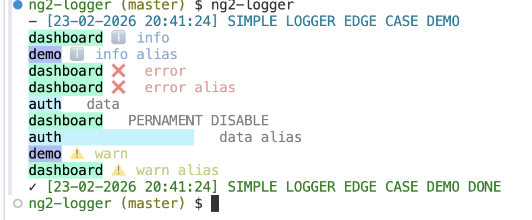

## taon-logger (ng2-logger) ##

- Part of [taon.dev](https://github.com/darekf77/taon)
- Isomorphic Logger for TypeScript and JavaScript apps.
- Purpose:
  + usefull/elegant backend/frontend logger

You can use this logger in your apps with **any**
TS/JS framework.

## ⚠️ Deprecation notes Level.__NOTHING  ⚠️
```ts
// Level.__NOTHING is now gone..⚠️

const log = Log.create('my module or file',Level.__NOTHING); // ❌

// USE INSTEAD

const log = Log.create('my module or file', Level.WARN, Level.ERROR); // ✅

// this will should you important warning and errors for development
// and in production to hide all ng2-logger logs use:

Log.disableAllLogs(); // ✅

```

## How to use ng2-logger 🚀

See what is going on in your app!

Now chrome console logs are full of colors!



See nice server logs:




To install package run:
```bash
npm install ng2-logger --save
```  

First import proper version for your environment:

Nodejs server (or any taon's lib/app):  

```ts
import { Log, Level } from  'ng2-logger/lib'
// commonjs
```

or Browser: 

```ts
import { Log, Level } from  'ng2-logger/browser'  
// esm version for browser

```

## Usage:  

In your file:

```ts
# all logs allowed to be visible
const  log  =  Log.create('books');
```

or if you wanna just log errors and warnings :

```ts
# only error and warn logs allowed to be visible
const  log  =  Log.create('books',
 Level.ERROR,
 Level.WARN,
);

```

'books' shoould be class, module or anything inside
 current *.ts/*.js file.

  
You can also assign static color to specific module in application:

```ts
log.color  =  'red';
```

After inited **log** you are able to start debugging:

```ts
log.d('object',obj) // console.log

log.er('object',obj) // console.error

log.i('object',obj) // console.info

log.w('object',obj) // console.warn

```

or

```ts

log.debug('object',obj) // console.log

log.error('object',obj) // console.error

log.info('object',obj) // console.info

log.warn('object',obj) // console.warn

```


**Production mode**
-------------------  

You will not see anyting in production mode:

```ts
import {Log} from 'ng2-logger/browser'

// disable all ng2-logger logs 
Log.disableAllLogsPermanetly();
// without possibility of enabling it again

// OR

// disable all logs, but 
Log.disableAllLogs();
// Log.enableAllLogs and enable it again
Log.enableAllLogs()
```

// your app code with console and ng2-logger logs

  
  
  

**Selective debug - global settings**

-------------------


Optionally specify what you wanna see in yours debug console.


```ts

Log.onlyModules('src:books', 'src:records', 'src:page:login');

Log.onlyLevel(Level.ERROR,Level.INFO);

```

  

**Specifying `onlyModules` as regular expression(s)**

-------------------

  

In the above example you'll notice `module:books` and `module:records` were specified.

you might be using such syntax for namespace hierarchy etc. You may also pass in one or more regular

expression string(s) to the `onlyModule` function to specify a selection of modules you wish

to show, for instances those whose name begins with `src`:

  

```ts
Log.onlyModules( new  RegEx('^.src') );
```
